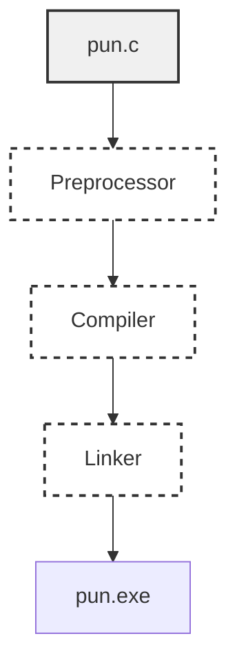

## 编译与链接

### ` pun.c`转化为` pun.exe`

>   1、预处理。程序交给预处理器（Preprocessor）执行` #` 开头的命令（指令），然后添加或修改程序。
>
>   2、编译。修改后的程序交给编译器（Compiler）翻译成机器指令(目标代码)
>
>   3、连接。链接器（Linker）把目标代码和所需的其他附加代码（如库函数）整合，产生可执行程序




### 终端运行

```shell
> gcc -O -Wall -W -pedantic -std=c11 -o pun pun.c
> .\pun
To C, or not to C: that is the question.

```

`GCC`命令行参数解释

| ` -Wall`    | 啊啊啊 |
| ----------- | ------ |
| `-W`        | 啊啊啊 |
| `-pedantic` | 啊啊啊 |
| `-ansi`     | 啊啊啊 |
| `-std=c11`  | 啊啊啊 |

